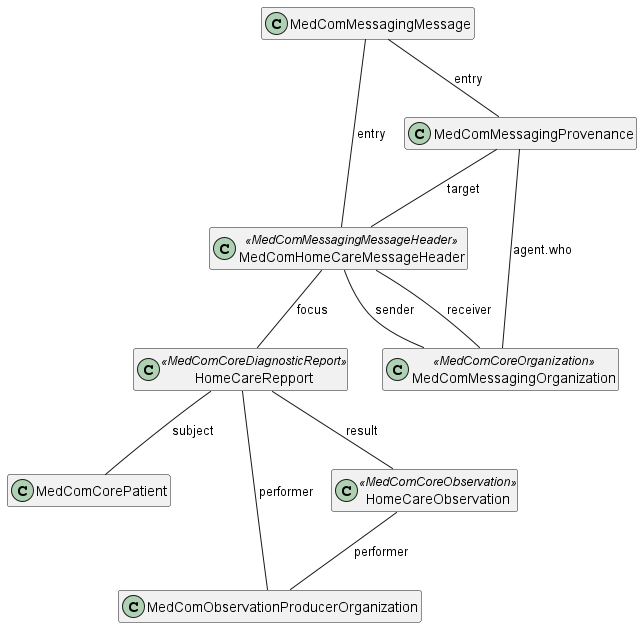

# Home

## Introduction
This implementation guide (IG) is provided by MedCom to describe the use of FHIR ®© in message based exchange of structured health informations between acute care team and the general practitioner.  

This IG contains profiles for MedCom HomeCareObservation message (Dansk: KommunalePrøvesvar) which is used to exchange results from perforemed HomeCare Observations by acute care teams in  danish municipalites. The HomeCareObservation message is intended to structure the observations result, so the general practitioner can create an overwiev of the patients helth values easyly and order a right treatment for the patiente. The message will structure the health assesments such as "ABCD-method and TOPS" and observations performend when using Point of Care Testing (POCT).

## Standard documentation

The structure of a HomeCareObservation standard is despicted on the following diagram:
<figure>

<figcaption text-align="center"><b>Figure 1: Overview of the references between profiles in a MedCom HomeCareObservation standard </b></figcaption>
</figure>
 
 

<!-- Indsæt diagram over diagnostic repport struktur og beskriv den. -->

HomeCareObservation follows the general MedCom FHIR messaging model, except that the carbon-copy destination is not allowed to use. The following sections describe the overall purpose of each profile.

#### MedCom Messaging Message
The [MedComMessagingMessage](http://medcomfhir.dk/ig/messaging/StructureDefinition/medcom-messaging-message) profille is used to bundle the whole HomeCare Observations together. All referenced resources in the HomeCareObservation message shall be contained in the entry list in MedComMessaginingMessage

The MedComMessaging require to use the [MedComHomeCareObservationsMessageHeader](http://medcomfhir.dk/ig/homecareobservation/StructureDefinition/medcom-homecareobservation-MessageHeader) and to require exactly one [MedComCorePatient](https://medcomfhir.dk/ig/core/StructureDefinition-medcom-core-patient.html) resource in the message.

#### MedComHomeCareObservationMessageHeader
The [MedComHomeCareObservationsMessageHeader](http://medcomfhir.dk/ig/homecareobservation/StructureDefinition/medcom-homecareobservation-MessageHeader) constrains the [MedComMessagingMessageHeader](https://medcomfhir.dk/ig/messaging/StructureDefinition-medcom-messaging-messageHeader.html) further to specify the fixed coding for this message and constrains the use of carbon-copy destination. 

#### MedComMessagingProvenance

#### MedComHomeCareRepport

#### MedComHomeCareObservation
The [MedComHomeCareObservation]()

#### MedComCorePatient
The [MedComCorePatient](http://medcomfhir.dk/ig/core/StructureDefinition-medcom-core-patient.html) profile is used in a MedComHomeCareObservations message. However, a MedComHomeCareObservations message may only be exchanged for patients with an official Danish civil person register (CPR)-number

#### MedComCoreOrganization 
The [MedComCoreOrganization](http://medcomfhir.dk/ig/core/StructureDefinition-medcom-core-organization.html) profile is used in a MedComHomeCareObservations message to describe the sender and receiver organization of the HomeCareRepport.

#### MedComCoreObservationPorducer
The [MedComCoreObservationProducer](#medcomcoreobservationporducer) profile is used in a MedComHomeCareObservation message to represents the organization that is responsible for the observation. 

#### Terminology
On [MedCom Terminology IG](http://medcomfhir.dk/ig/terminology/) all referenced CodeSystem and ValueSets developed by MedCom can be found.

## Download 
Content in this IG can be downloaded in npm format under [Download](https://medcomfhir.dk/ig/MedComHomeCareObservations/downloads.html). This can be used to validate locale FHIR profiles against.

## Documentation
On the [introduction page for HomeCareObservations](https://medcomdk.github.io/dk-medcom-homecareobservations/) the following documentation can be found: 
* Clinical guidelines
* Use cases

## Governance 

## Quality Assurance Report

In the Quality Assurance report (QA-report) for this IG, there is an error with the following description: *Reference is remote which isn’t supported by the specified aggregation mode(s) for the reference (bundled)*. The error occurs when creating instances of the profiles and is due to some elements having a Bundled flag {b}, however the referenced profile is not included in a Bundle in an instance, since the instance only represents a part of the entire message. This should not influence the implementation by IT-vendors.

## Contact 

[MedCom](https://www.medcom.dk/) is responsible for this IG.

If you have any questions, please contact <fhir@medcom.dk> or write to MedCom's stream in [Zulip](https://chat.fhir.org/#narrow/stream/315677-denmark.2Fmedcom.2FFHIRimplementationErfaGroup).

